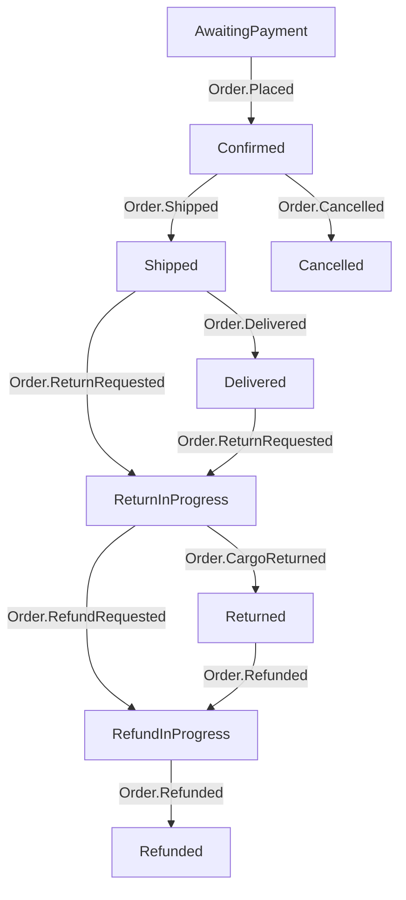

# Tutorial

## install

```shell
go get github.com/KScaesar/easyFSM
```

## Example

### Step 1: Define state-diagram on the Mermaid website

- [state-diagram-docs](https://github.com/mermaid-js/mermaid#state-diagram-docs---live-editor)  
- [live editor](https://mermaid.live/edit)  



### Step 2: Define transitions in Golang code

1. The FSM should be placed in the global scope.
2. When importing the package, transitions should be added using the DefineTransition function during the initialization step.
3. The event triggering the transition.

```go
// Parameters:
// - event: The event triggering the transition.
// - src: The source state from which the transition is allowed.
// - dest: The destination state to which the FSM will transition when the event occurs in the source state.
func (fsm *FSM[E, S]) DefineTransition(event E, src, dest S) *FSM[E, S]
```

```go
var OrderStateFSM = NewFSM[OrderEventTopic, OrderState](OrderStateAwaitingPayment).
	DefineTransition(OrderEventTopicPlaced, OrderStateAwaitingPayment, OrderStateConfirmed).
	DefineTransition(OrderEventTopicShipped, OrderStateConfirmed, OrderStateShipped).
	DefineTransition(OrderEventTopicDelivered, OrderStateShipped, OrderStateDelivered).
	DefineTransition(OrderEventTopicCancelled, OrderStateConfirmed, OrderStateCancelled).
	DefineTransition(OrderEventTopicReturnRequested, OrderStateShipped, OrderStateReturnInProgress).
	DefineTransition(OrderEventTopicCargoReturned, OrderStateReturnInProgress, OrderStateReturned).
	DefineTransition(OrderEventTopicRefundRequested, OrderStateReturnInProgress, OrderStateRefundInProgress).
	DefineTransition(OrderEventTopicRefunded, OrderStateRefundInProgress, OrderStateRefunded).
	DefineTransition(OrderEventTopicRefunded, OrderStateReturned, OrderStateRefundInProgress).
	DefineTransition(OrderEventTopicReturnRequested, OrderStateDelivered, OrderStateReturnInProgress)

type OrderEventTopic string

const (
	OrderEventTopicPlaced          OrderEventTopic = "Order.Placed"
	OrderEventTopicShipped         OrderEventTopic = "Order.Shipped"
	OrderEventTopicCancelled       OrderEventTopic = "Order.Cancelled"
	OrderEventTopicDelivered       OrderEventTopic = "Order.Delivered"
	OrderEventTopicReturnRequested OrderEventTopic = "Order.ReturnRequested"
	OrderEventTopicCargoReturned   OrderEventTopic = "Order.CargoReturned"
	OrderEventTopicRefundRequested OrderEventTopic = "Order.RefundRequested"
	OrderEventTopicRefunded        OrderEventTopic = "Order.Refunded"
)

type OrderState string

const (
	OrderStateAwaitingPayment  OrderState = "AwaitingPayment"  // 訂單已建立，但尚未收到付款
	OrderStateConfirmed        OrderState = "Confirmed"        // 訂單已經確認，支付和庫存等相關事宜已完成，等待商品出貨
	OrderStateShipped          OrderState = "Shipped"          // 商品已經發貨，正在運送途中
	OrderStateDelivered        OrderState = "Delivered"        // 商品已經成功送達到顧客手中，交易完成
	OrderStateCancelled        OrderState = "Cancelled"        // 訂單在處理過程中被取消，交易不會繼續進行
	OrderStateReturnInProgress OrderState = "ReturnInProgress" // 顧客申請退貨，退貨正在處理中
	OrderStateReturned         OrderState = "Returned"         // 退貨流程已完成，商品已經退回並接收
	OrderStateRefundInProgress OrderState = "RefundInProgress" // 退款正在處理中，將退還付款給顧客
	OrderStateRefunded         OrderState = "Refunded"         // 退款已經完成，付款已退還給顧客
	// OrderStateError            OrderState = "Error"            // 訂單面臨付款錯誤、庫存問題或其他技術問題
)
```

### Step 3: Verify that Golang FSM meets expectations

```go
func TestMermaidGraphByTopDown(t *testing.T) {
	expected := `
graph TD
  AwaitingPayment --> |Order.Placed| Confirmed
  Confirmed --> |Order.Shipped| Shipped
  Shipped --> |Order.Delivered| Delivered
  Confirmed --> |Order.Cancelled| Cancelled
  Shipped --> |Order.ReturnRequested| ReturnInProgress
  ReturnInProgress --> |Order.CargoReturned| Returned
  ReturnInProgress --> |Order.RefundRequested| RefundInProgress
  RefundInProgress --> |Order.Refunded| Refunded
  Returned --> |Order.Refunded| RefundInProgress
  Delivered --> |Order.ReturnRequested| ReturnInProgress
`
	actual := MermaidGraphByTopDown(OrderStateFSM, nil)

	if expected != actual {
		t.Errorf("expected = %v, but actual = %v", expected, actual)
	}
}
```

### Step 4: Call the domain object method in Domain-Driven Design (DDD)

[playground](https://go.dev/play/p/-6d8ugyIlDX)

```go
func ExampleFSM_OnAction() {
	repo := MemoryOrderRepository{}
	ctx := context.Background()

	// UseCaseSuccess:
	// ReturnRequest success!!
	fmt.Printf("UseCaseSuccess:\n")
	err := OrderUseCaseSuccess(repo, ctx)
	if err != nil {
		fmt.Println(err)
	}

	// UseCaseFail:
	// key = {event: Order.ReturnRequested, requiredState: Delivered}, but currentState = Cancelled: state not match
	fmt.Printf("\nUseCaseFail:\n")
	err = OrderUseCaseFail(repo, ctx)
	if err != nil {
		fmt.Println(err)
	}
}

type Order struct {
	Id string
	// ... other field
	State OrderState
}

func (o *Order) ReturnRequest() error {
	fsm := OrderStateFSM.SetCurrent(o.State)
	return fsm.OnAction(OrderEventTopicReturnRequested, func(nextState OrderState) error {
		o.State = nextState
		fmt.Println("ReturnRequest success!!")
		return nil
	})
}

func OrderUseCaseSuccess(repo OrderRepository, ctx context.Context) error {
	order, err := repo.LockOrderById(ctx, "action_success")
	if err != nil {
		return err
	}

	return order.ReturnRequest()
}

func OrderUseCaseFail(repo OrderRepository, ctx context.Context) error {
	order, err := repo.LockOrderById(ctx, "action_fail")
	if err != nil {
		return err
	}

	return order.ReturnRequest()
}
```